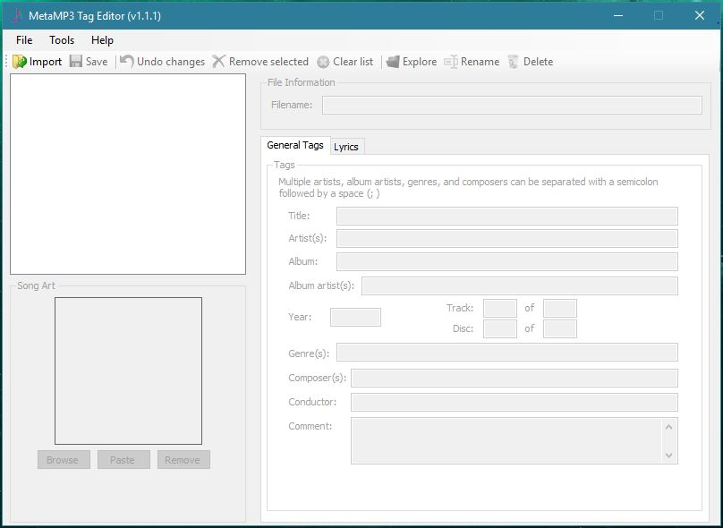

# MetaMP3

This repo includes some of my practice with Visual Basic. It contains MetaMP3, an ID3 tag editor that can be used to embed data into an MP3 file. MetaMP3 allows for editing covers, lyrics, and other metadata. There is also a feature to export tags to a file. MetaMP3 uses dependencies TagLib Sharp and Setting.

## Screenshot

